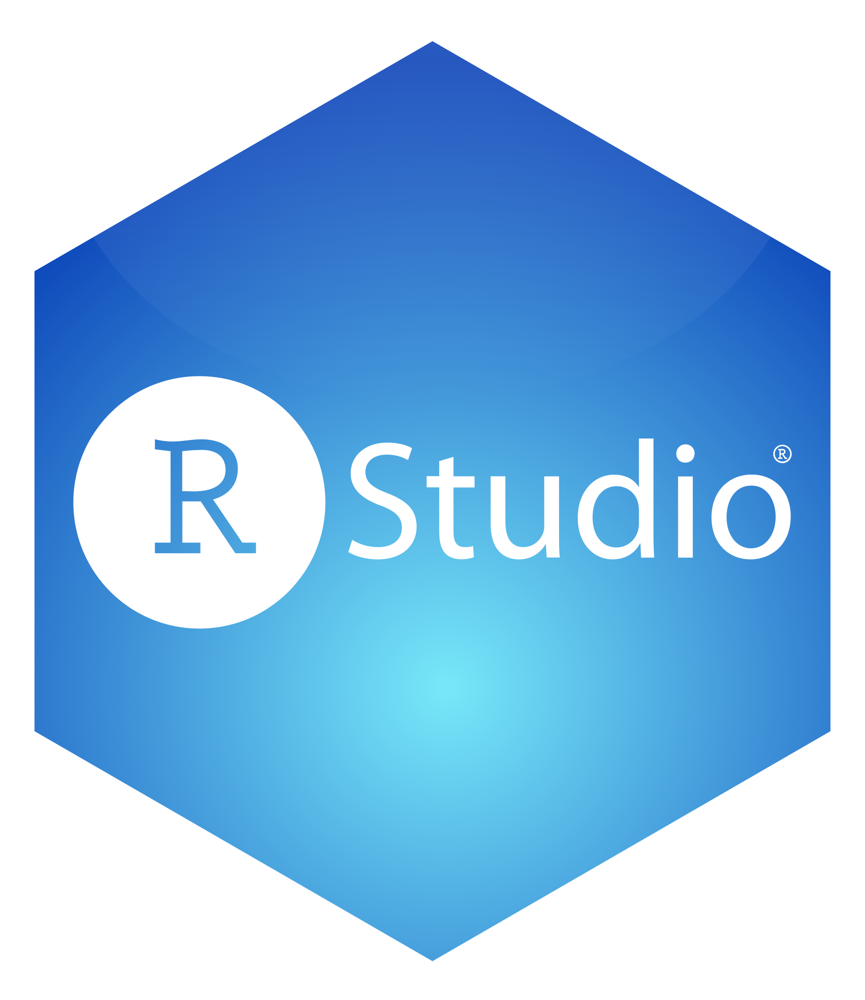
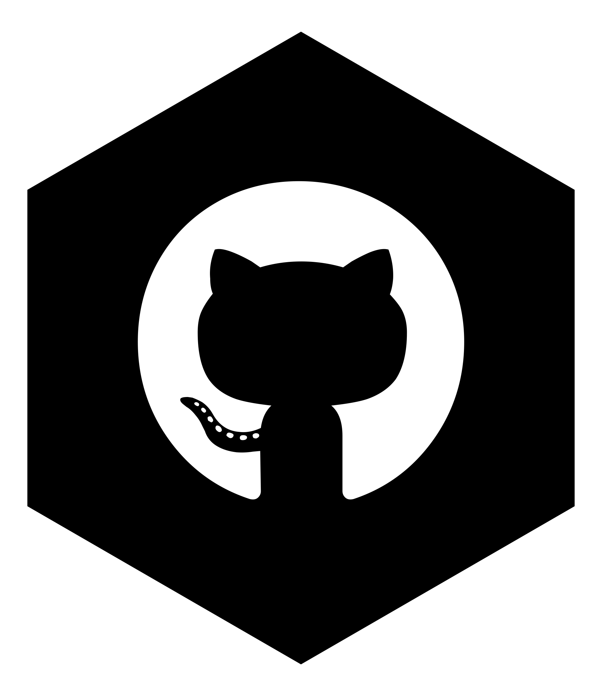

```{r, include=FALSE}
knitr::opts_chunk$set(results = 'asis',
                      echo = FALSE,
                      warning = FALSE,
                      tidy = FALSE,
                      message = FALSE,
                      fig.align = 'center',
                      out.width = "100%",
                      cache = TRUE)
options(knitr.table.format = "html") 
```

# Purpose & Goals

Creating meaningful projects in a data science course can be a time consuming task! With the given example project instructions students:

-   must **conceptualize how R data is stored and how to manipulate it** into a useful form
-   must be able to **write custom R functions** meant for another user
-   may seek out and **find a data source meaningful to them**
-   are forced to **think about the type(s) of data** they are downloading and **how they can be summarized** to meet the Exploratory Data Analysis (EDA) requirements
-   **use good programming practices** in a larger project setting
-   **communicate their code and results**
-   (advanced version) create a website to show off their work through RMarkdown and github pages

# Project Requirements

-    `R` & `RStudio` <br><br>
-    `RMarkdown` to easily create an HTML document with code & output embedded
-    `dplyr` (or Base R) for common data manipulation tasks <br>
-    `ggplot2` (or Base R) for summarizing the data<br><br>
-    Ability to write custom `R` functions<br><br>
-    `Github` (optional) - for easy creation of a web site to share their work<br>
-   Basic lesson on APIs and handling JSON data

## Application Program Interfaces (APIs)

API - think of as a protocol for passing information between computers

-   Build URLs to request specific data: `https://api.polygon.io/v2/aggs/ticker/`<font color="blue">AAPL</font>`/range/1/day/`<font color="blue">2023-01-09</font>/<font color="blue">2023-01-09</font>`?apiKey=*`
-   `httr::GET()` for contacting the API via the URL
-   Process `content` element using `rawToChar()`
-   Use `jsonlite::fromJSON()` to turn results into lists!:
    -   `httr::GET(URL)$content %>% rawToChar() %>% jsonlite::fromJSON()`

# Project Instructions

Create a vignette (long form description of how a problem was solved) that provides a narrative for using custom functions to contact an API, parse, and return well-structured data. They then use those functions to obtain data from the API and do some exploratory data analysis.

-   Vignette written in R Markdown
-   Functions return well-formatted data frames. Requirement:
    -   Query at least five different *end points*
    -   Not the entire API!
-   EDA conducted on resulting data. Requirements:
    -   Contingency tables
    -   Summary statistics (means, sds, etc.) at levels of categorical variables
    -   Bar plot, histogram, box plot, and scatter plot
-   Narrative through document explaining process and results
-   (Optional) Upload to `github` and use *GitHub pages* to render a web page

# Resources

Material below available at <a href = "http://go.ncsu.edu/uscots2023" style = "color:blue;">go.ncsu.edu/uscots2023</a> (or use the QR code)

- Example notes for querying an API
- Two versions of project instructions
    -   Basic version with no github
    -   Advanced version that uses github pages to render a web page
    -   Simple point rubric included
- Example course projects (thank you to these former students!):
    -   <a href = "https://kbelkna.github.io/Project2/" style = "color:blue;">spoonacular API (wine and food)</a>
    -   <a href = "https://rhencher.github.io/ST558-Project2/" style = "color:blue;">College Scorecard API</a>
    -   <a href = "https://bbittne.github.io/Project1/" style = "color:blue;">polygon.io Stock Data API</a>
    -   <a href = "https://github.com/brknapp/Project_1" style = "color:blue;"> Open Movie Database API</a>
    -   <a href = "https://sbgadhwala.github.io/ST558_Project2/" style = "color:blue;"> NASA API</a>
    -   <a href = "https://cmknezev.github.io/ST-558-Project-1/Pokemon-API-Vignette-.html" style = "color:blue;"> Pokemon API</a>
- <a href = "https://jbpost2.github.io/pages/R.html"  style = "color:blue;">Basics of R Open Course</a>